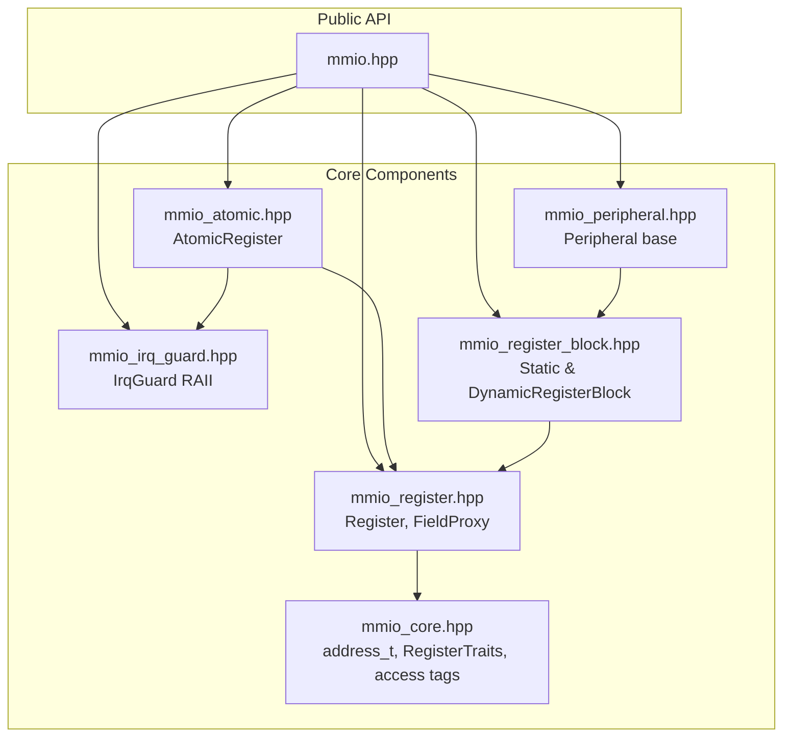
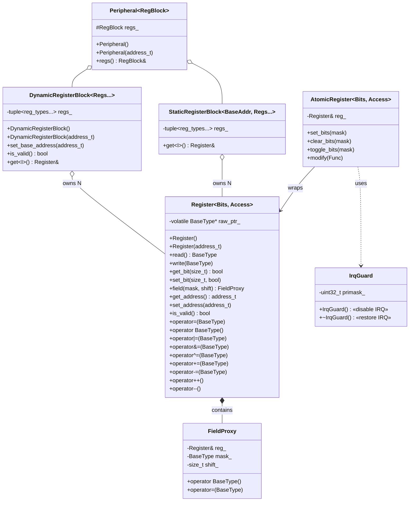
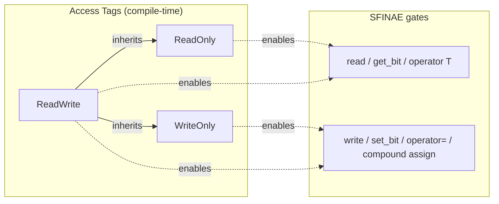
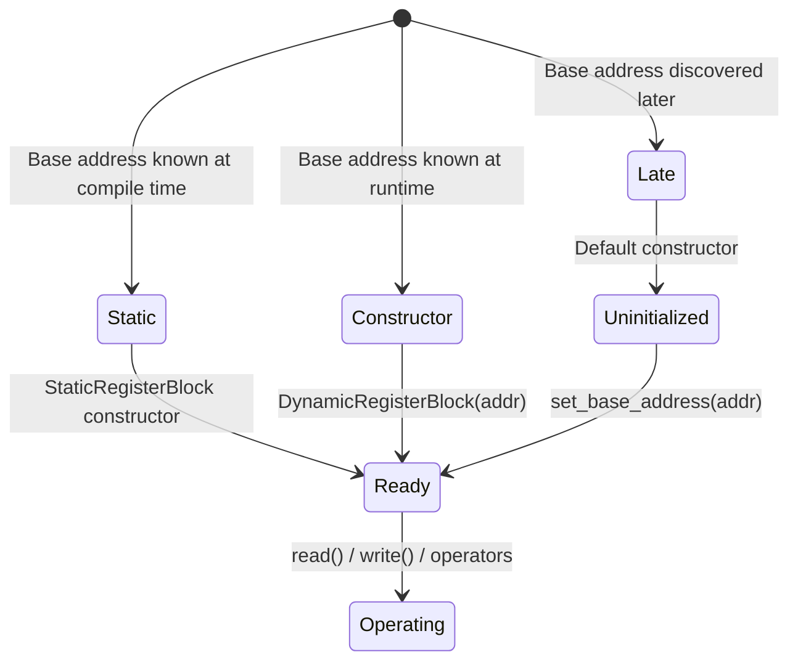
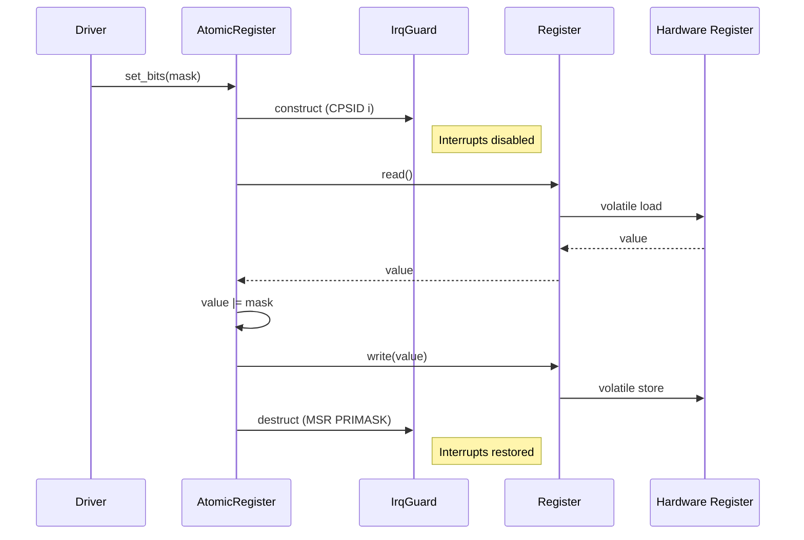

# MMIO Library — Architecture

## Purpose

`mmio-cpp` provides a type-safe abstraction over raw hardware register access. Instead of casting addresses to `volatile` pointers manually, developers declare registers with their size (8/16/32/64 bits) and access policy (read, write, or both). The compiler enforces correctness — writing to a read-only register is a compile error, not a runtime bug.

## Design Goals

1. **Zero overhead** — every operation compiles to the same instructions as hand-written volatile access
2. **Compile-time safety** — invalid operations fail at build time, not on the target
3. **Testable on host** — registers can be backed by stack variables for unit testing without hardware
4. **No runtime cost** — no heap, no RTTI, no exceptions, no virtual dispatch
5. **Composable** — registers group into blocks, blocks compose into peripherals

## Module Structure



## Class Diagram



## Access Policy Enforcement



Attempting to call `write()` on a `Register<32, ReadOnly>` triggers a substitution failure — the code does not compile. No runtime check needed.

## Register Block Initialization Modes



## Atomic Operations Flow



## Memory Layout (no heap)

The entire library operates on the stack or in static storage:

```
┌─────────────────────────────────────┐
│ Register                            │
│   raw_ptr_: volatile T* (1 pointer) │
│   sizeof = sizeof(void*)            │
├─────────────────────────────────────┤
│ DynamicRegisterBlock<R0, R1, R2>    │
│   tuple<Register, Register, Register>│
│   sizeof = N × sizeof(void*)        │
├─────────────────────────────────────┤
│ Peripheral<Block>                   │
│   block_: Block                     │
│   sizeof = sizeof(Block)            │
└─────────────────────────────────────┘

Heap: never used
Virtual table: none
```

## Design Decisions

| Decision | Rationale |
|----------|-----------|
| Header-only | No link-time surprises; enables LTO to inline everything |
| No virtual methods | Zero overhead — peripheral drivers inherit statically |
| `volatile` via pointer, not member | Allows default-constructed "null" registers for testing |
| SFINAE over concepts | C++17 compatibility (concepts require C++20) |
| Fold expressions for init | Clean O(1) expansion for any number of registers |
| Separate `IrqGuard` | Platform-specific; easily replaced per MCU family |
| `is_valid()` check | Supports two-phase init without undefined behavior |
