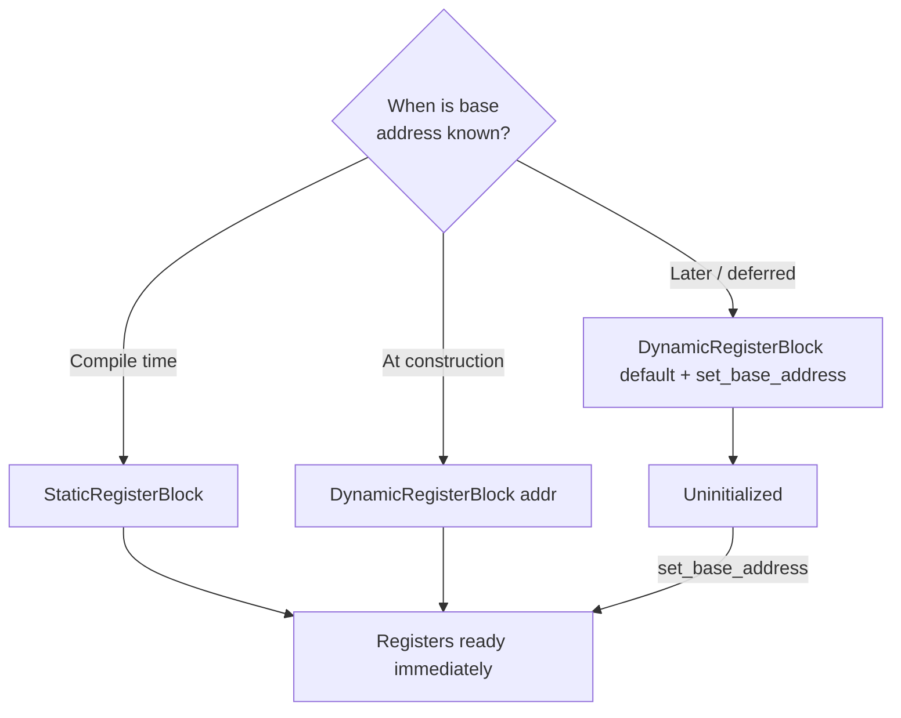
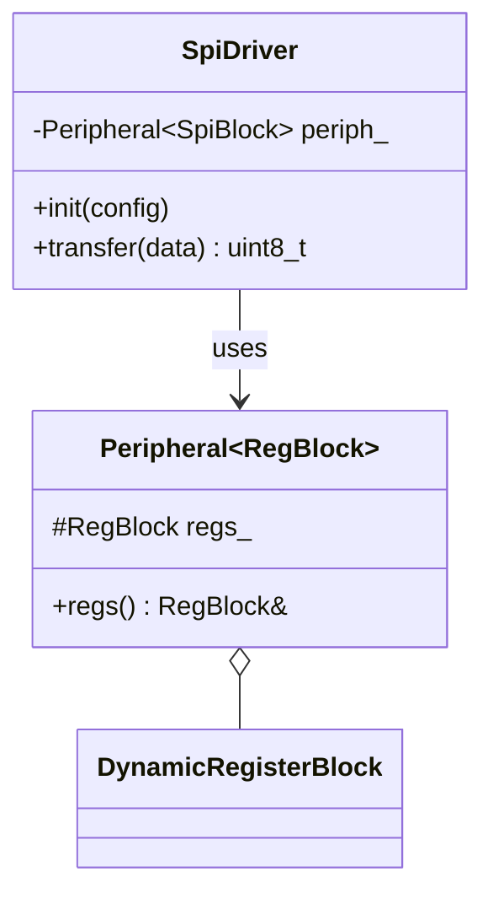

# MMIO Usage Guide

## Overview

This library abstracts memory-mapped hardware registers into C++ objects with compile-time type safety. It's designed for ARM Cortex-M microcontrollers where peripherals are accessed by reading/writing to fixed memory addresses.

## Core Concept

Every hardware peripheral on an STM32 (or any ARM Cortex-M) exposes its configuration through memory-mapped registers — contiguous 32-bit words at a known base address. For example, the STM32F429 SysTick timer has:

```
Base: 0xE000E010
├── CSR  (offset 0x00) — Control and Status
├── RVR  (offset 0x04) — Reload Value
├── CVR  (offset 0x08) — Current Value
└── CALIB(offset 0x0C) — Calibration
```

This library models that layout directly:

```cpp
using SysTickBlock = mmio::DynamicRegisterBlock<
    mmio::at_offset<0x00, 32, mmio::ReadWrite>,  // CSR
    mmio::at_offset<0x04, 32, mmio::ReadWrite>,  // RVR
    mmio::at_offset<0x08, 32, mmio::ReadWrite>,  // CVR
    mmio::at_offset<0x0C, 32, mmio::ReadOnly>    // CALIB
>;

SysTickBlock systick(0xE000E010);
systick.get<0>().set_bit(0, true);  // Enable SysTick
```

## Base Address Initialization



### Mode 1: Static (compile-time base address)

```cpp
using GpioA = mmio::StaticRegisterBlock<0x48000000,
    mmio::at_offset<0x00, 32, mmio::ReadWrite>,  // MODER
    mmio::at_offset<0x04, 32, mmio::ReadWrite>,  // OTYPER
    mmio::at_offset<0x14, 32, mmio::ReadWrite>   // ODR
>;

GpioA gpioa;
gpioa.get<2>().set_bit(5, true);  // Set PA5 output high
```

### Mode 2: Constructor (runtime base address)

```cpp
using UartBlock = mmio::DynamicRegisterBlock<
    mmio::at_offset<0x00, 32, mmio::ReadWrite>,  // SR
    mmio::at_offset<0x04, 32, mmio::ReadWrite>,  // DR
    mmio::at_offset<0x08, 32, mmio::ReadWrite>,  // BRR
    mmio::at_offset<0x0C, 32, mmio::ReadWrite>   // CR1
>;

UartBlock uart1(0x40011000);  // USART1
UartBlock uart2(0x40004400);  // USART2 — same layout, different base
```

### Mode 3: Late initialization (two-phase)

```cpp
UartBlock uart;  // default — is_valid() == false

void board_init(mmio::address_t uart_base) {
    uart.set_base_address(uart_base);
    // Now is_valid() == true, safe to use
}
```

## Writing a Peripheral Driver



Example SPI driver:

```cpp
#include "mmio.hpp"

class Spi {
public:
    explicit Spi(mmio::address_t base) : regs_(base) {}

    void init(std::uint32_t prescaler) {
        regs_.get<1>() = prescaler;         // CR1
        regs_.get<1>().set_bit(6, true);    // SPE — enable
    }

    std::uint8_t transfer(std::uint8_t tx) {
        while (!regs_.get<0>().get_bit(1)) {}  // Wait TXE
        regs_.get<2>() = tx;                    // Write DR
        while (!regs_.get<0>().get_bit(0)) {}  // Wait RXNE
        return static_cast<std::uint8_t>(regs_.get<2>().read());
    }

private:
    using Block = mmio::DynamicRegisterBlock<
        mmio::at_offset<0x00, 32, mmio::ReadOnly>,   // SR
        mmio::at_offset<0x04, 32, mmio::ReadWrite>,  // CR1
        mmio::at_offset<0x0C, 32, mmio::ReadWrite>   // DR
    >;
    Block regs_;
};
```

## Atomic Operations

When a read-modify-write must not be interrupted (e.g., shared register accessed from ISR and main loop):

```cpp
mmio::Register<32, mmio::ReadWrite> shared_reg(0x40000000);
mmio::AtomicRegister<32> atomic(shared_reg);

atomic.set_bits(0x01);    // Atomically OR
atomic.clear_bits(0x80);  // Atomically AND with complement
atomic.modify([](std::uint32_t& val) {
    val = (val & ~0xF0) | 0x30;  // Custom RMW
});
```

## Testing on Host

Registers can point to local variables — no hardware needed:

```cpp
std::uint32_t fake_hw = 0;
mmio::Register<32> reg(reinterpret_cast<mmio::address_t>(&fake_hw));

reg = 0x1234;
assert(fake_hw == 0x1234);  // Backed by stack memory
```

## Summary

| Mode | Type | Use Case |
|------|------|----------|
| Static | `StaticRegisterBlock<Addr, ...>` | Fixed peripherals (GPIO, SysTick) |
| Constructor | `DynamicRegisterBlock(addr)` | Multiple instances (UART1, UART2) |
| Late | Default + `set_base_address()` | Board-level init, runtime discovery |
